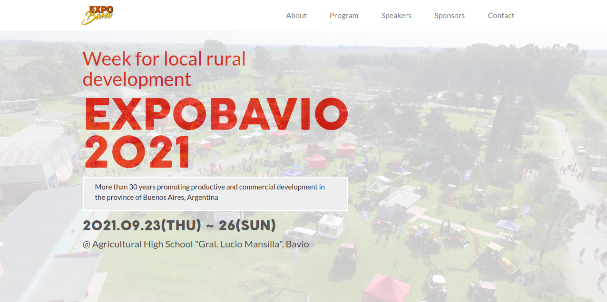

# Expobavio web site

> This project is proposed by Microverse as capstone project for the first module. The topic I chose to work on is creating a website for a rural exhibition that took place in my town every year before Covid. The design was obtained from [this template](https://www.behance.net/gallery/29845175/CC-Global-Summit-2015).

## Built With

- HTML
- CSS
- Javascript
- Bootstrap

## Live Demo

[Expobavio](https://nachosala89.github.io/agro-expo/)

## Getting Started

To get a local copy up and running follow these simple example steps:
- Clone the repo to your computer.
- Open index.html in your browser.

👤 **Nacho Sala**

- GitHub: [@nachosala89](https://github.com/nachosala89)
- Twitter: [@nachosala89](https://twitter.com/nachosala89)
- LinkedIn: [Juan Ignacio Sala](https://www.linkedin.com/in/juan-ignacio-sala)

## 🤝 Contributing

Contributions, issues, and feature requests are welcome!

Feel free to check the [issues page](../../issues/).

## Show your support

Give a ⭐️ if you like this project!

## Acknowledgments

Thanks to [Cindy Shin](https://www.behance.net/adagio07) for the template in which this design was inspired.

## 📝 License

This project is [MIT](./MIT.md) licensed.